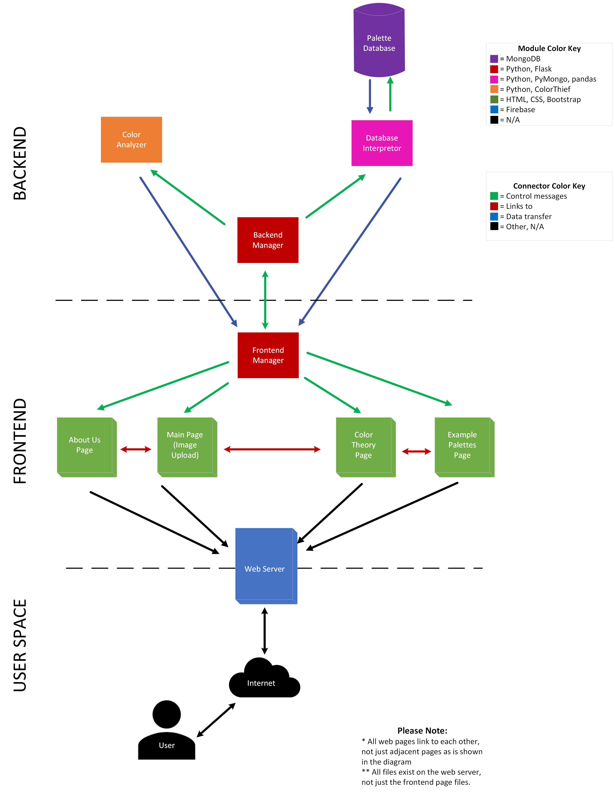

Software Architecture
=====================

The divide between frontend and backend was a guiding force in designing our software architecture. On one hand, it was important to maintain modularity within the two sides for ease of development. On the other, it was key that the two sides communicate fluidly so that the entire system could function properly. This led us to creating a "manager" module for both sides and use Flask as our framework throughout. 

The diagram below shows our architecture visually. Note that there is a third section of the application shown which is dubbed the "User Space." This is not part of our implementation, but is an essential component of our design because ultimately Gbiv is built for the users.

   Gbiv Software Architecture

The model above shows both components of the system and their interactions. We can further elaborate our architecture by focusing on each of these dimensions in particular. First, we can examine the individual components using the following table:

.. list-table:: Software Architecture Modules and Sub-Modules
   :name: software-architecture-modules-and-sub-modules
   :class: longtable
   :widths: 30 20 50

   * - **Module/Sub-Module**
     - **Category**
     - **Functionality**
   * - Palette Database
     - Backend
     - Stores popular palettes that many users have viewed.
   * - Database Interpretor
     - Backend
     - Interfaces with database to pass queries from the system to the DB and to transfer data from the DB to the rest of the application.
   * - Color Analyzer
     - Backend
     - Extracts dominant color from images, finds related colors, generates relevant palettes.
   * - Backend Manager
     - Backend
     - Communicates with frontend and sends control messages to backend modules.
   * - Frontend Manager
     - Frontend
     - Communicates with backend and sends control messages to frontend modules.
   * - About Us Page
     - Frontend
     - Tells users about the team and the project.
   * - Main Page (Image Upload)
     - Frontend
     - Allows users to upload image files and view dominant color, related colors, and relevant palettes.
   * - Color Theory Page
     - Frontend
     - Gives users more information on the basics of color theory so that they understand what Gbiv is providing.
   * - Popular Palettes Page
     - Frontend
     - Displays popular palettes in the Gbiv database to give users ideas and inspiration for their design projects.
   * - Web Server
     - Frontend / User Space
     - Bridges the gap between the application and the user space. Hosts Gbiv files and provides infrastructure for the application to be accessed via web browsers.
   * - Internet
     - User Space
     - The network infrastructure that allows users to access the application.
   * - User
     - User Space
     - Anyone and everyone who has an interest in design and/or color theory.

Looking at each component in isolation is one way of viewing a system, but equally important to the application is the interactions between these components. The software architecture design shows all communication between modules, but we can highlight a few of the key interactions to better understand how Gbiv will function.

First, we can look at the transferring of control messages between the frontend and backend manager modules. These messages are formatted with the Flask python framework which is also used in implementing both of these key modules. Having consistent implementation and technology in these "bridge" modules allows communication without complicated translation or an additional framework in the mix.

Another key interaction we can profile is the web server's interface with both the front end and user space. Web hosting is what allows us to easily provide the functionality of Gbiv to end-users. We decided to use Firebase for our web hosting because it allowed us to outsource server side logic and networking while maintaining the unique design of our web page. Web hosting is a great way to reach users because it provides an interface that is easily accessible and familiar to the majority of the target users. 

