Software Modules
=================

Below are in depth descriptions of the design of each individual software module. It should be noted that not every component of the software architecture (see :numref:`software-architecture`) is included in this list because not every component is part of the system we implemented. In particular, we do not describe users (for more information on users see the SRS), the Internet, or our web server (for which we used a OOTBS/COTS).

.. _frontend-manager:

Frontend Manager
-----------------

The purpose of the frontend manager module is to help bind together separate components of the system. In particular, it is one half of the duo that is responsible for bridging the front and the back end (for more information on the other component of that connection see :numref:`backend-manager`). Because the frontend manager acts primarily as a middle ground for passing information and control messages, it does not have much internal structure. However, we can still represent this module in a static fashion using the diagram below. Note that there is still interfacing with other modules in this model because the frontend manager is defined by its interface with other parts of the system.

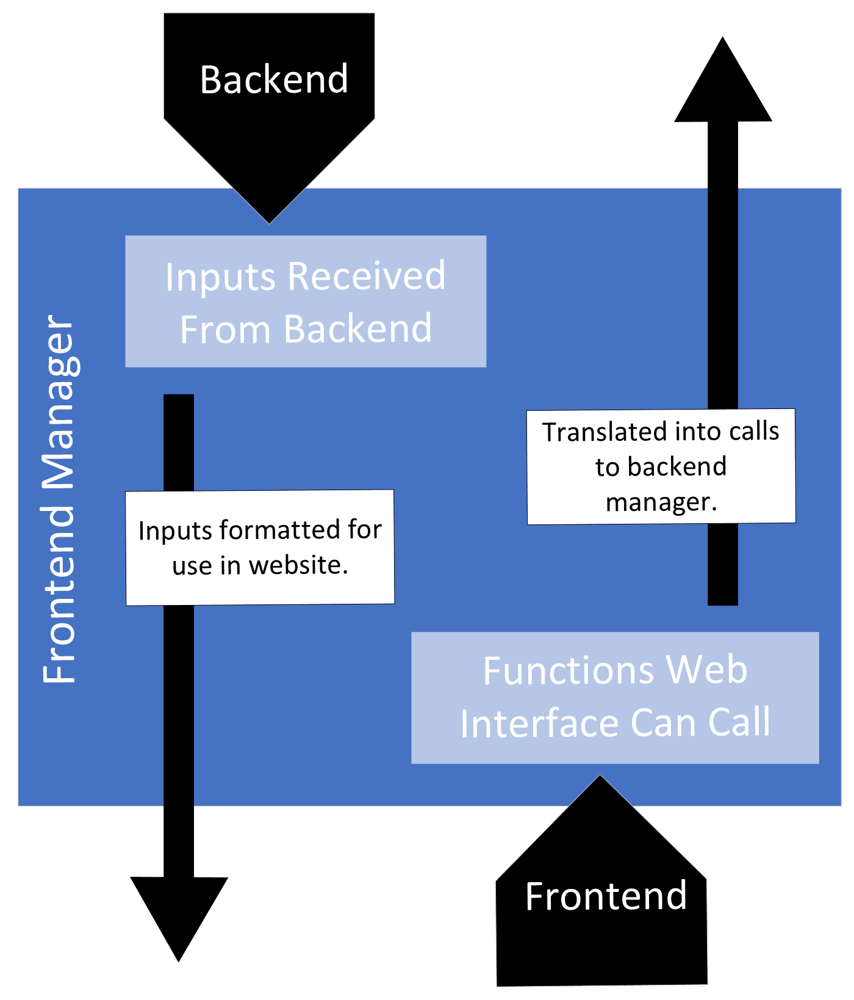

   Frontend Manager Static Model

.. raw:: latex

   \clearpage

The frontend manager acts as a sort of "ambassador" between the frontend and the backend which means it accepts inputs and outputs from both sides. On the backend side, this module gives outputs to the backend manager and receives inputs from both the color analyzer and database interpretor modules. The outputs that are given to the backend manager are control messages that indicate what the user is "asking for," which results in the proper data being generated. The inputs from the backend are different types of data intended to be delivered to end-users. Because this module is implemented using the same framework and technologies as the backend, the data can be transferred directly from where it is generated to the frontend manager. 

In terms of interfacing with the frontend, we can again divide the interactions into inputs and outputs. Inputs from the frontend originate from user interaction which is translated into function calls to the frontend manager. Outputs to the frontend carry essentially the same information that has been generated in the backend, but it is important that the data is formatted for wed display so that it can be utilized to change the website graphically. A dynamic diagram can be used to show these interfaces in a more streamlined way:

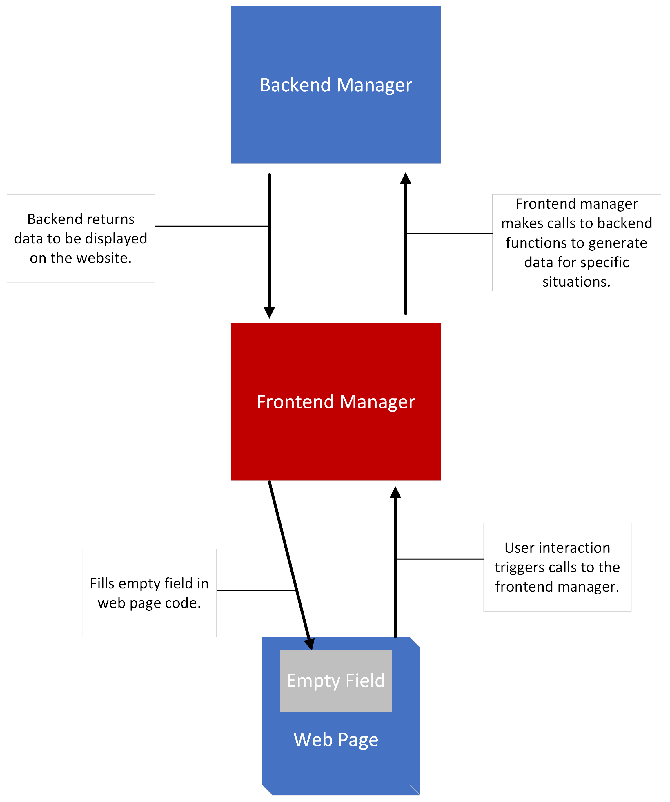

   Frontend Manager Dynamic Model

.. raw:: latex

   \clearpage

The design rationale behind the frontend manager can be summarized as: optimizing system communication. We could have designed Gbiv so that frontend components interfaced directly with backend modules, but by establishing a central place for inputs from and outputs to user-facing modules, we simplified our implementation significantly. 

Web Interface
---------------

The Web Interface module is essential to the system because it defines the user experience in our application. The design of our website follows the traditional multi-page model seen on many popular websites with a navbar at the top to navigate between the pages. Each page has a different functionality and displays different information to the user. The general layout of each page is shown visually in the static diagram below:

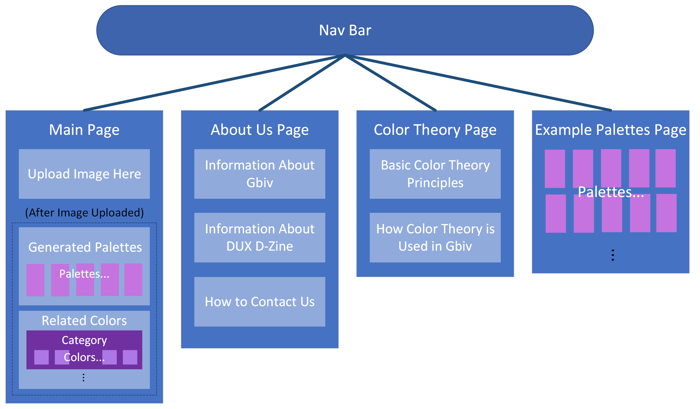

   Web Interface Static Model

There are two main interactions that the web interface has with other components in the system. First, it interacts extensively with the users through Internet by way of the server it is hosted on. The web interface is how the user requests the services that Gbiv provides and receives the information that is generated in response to these requests. Gbiv is a web-hosted application, which makes the server that hosts our application absolutely vital in the interface between users and the website module.

The second interaction that is key to keep the web interface functioning is the communication between each page and the Frontend Manager module. The Frontend Manager connects the user-facing display with the backend functionality and allows for dynamic pages that change in response user input. These two types of interaction are elaborated on in the dynamic model below:

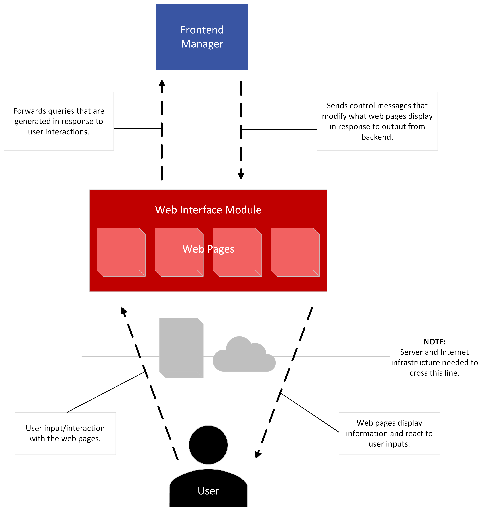

   Web Interface Dynamic Model

.. raw:: latex

   \clearpage

The website was designed in this way for two primary reasons: (1) the multi-page website is familiar and therefore easily navigable for our users and (2) having separate pages increases modularity. The former point is important for Gbiv because our target users are a very wide demographic, so we want an intuitive and accessible user interface. The latter point has important advantages when it comes to the development of the system. In particular, modularity allows for easier delegation of tasks and for more efficient and focused debugging when problems arise.

The web interface module can be divided into sub-modules based on separate pages on the site. Below we have a brief description of each page's functionality and structure.

Main Page (Upload an Image)
#############################

This is the page where users can upload an image to have its dominant color extracted and related colors and palettes generated for that dominant color. For more information on the dynamics of this use case see :numref:`use-case-1`. At first the page will only have a skeleton with blank palettes and color blocks, but after the user uploads a valid image, those blocks will be populated with the generated colors. The users will be able to filter the palettes that have been generated by selecting tags that will be displayed above the palettes section.

Example Palettes Page
#######################

This page of our website shows a variety of example palettes so that users can get ideas and inspiration for their own color palettes. When the user opens the page, the system will query the backend database which will result in a series of 4-color palettes being displayed as blocks. Like the palette section on the main page, the example palettes section will have several tags along the top which users can select to filter out the results displayed. For more information on the moving parts of this process see :numref:`use-case-2`.

Color Theory Page
##################

This part of the website is purely informational. It will provide users with basic knowledge of color theory and show how the principles of this discipline have been applied in Gbiv to generate new colors after an image has been uploaded.

About Us Page
################

Like the color theory page, the "About Us" page has little to do with the dynamics of Gbiv, rather it exists to provide background to the users. Information about the project and the team are important from a developer's perspective because we like to get credit for our hard work. However, it also benefits the user because it provides an avenue for contacting the team to report bugs or to become a contributor themselves if we make this system open source in the future.

.. _backend-manager:

Backend Manager
-----------------

The functionality of the backend manager is very similar to that of the frontend manager (see :numref:`frontend-manager`) in that it is middle ground for communication throughout the system. It is a vital part of the overall framework of Gbiv because without it the connection between the front and backend would be much more complex and vulnerable to bugs. Like the other "manager" module, this component is mostly defined by its interaction with other modules. However, we can still make a basic static diagram that shows the structure through which information flows:

.. figure:: images/backend_manager_static.png
   :name: backend-manager-static
   :scale: 20%

   Backend Manager Static Model

The backend manager has both inputs and outputs from the front and backend. On the frontend, the inputs come mostly in the form of requests for data and/or computation that requires backend modules. The outputs to the frontend are entirely control messages because the backend modules that manage computation and data retrieval can return directly to the frontend manager. The outputs to the backend come in the form of function calls to either the color analyzer or database interpretor modules. In addition to these function calls, control messages may be passed along to the backend for special cases such as error handling and application updates. To show all of these inputs and outputs in a concise manner we can build a dynamic model for the backend manager:

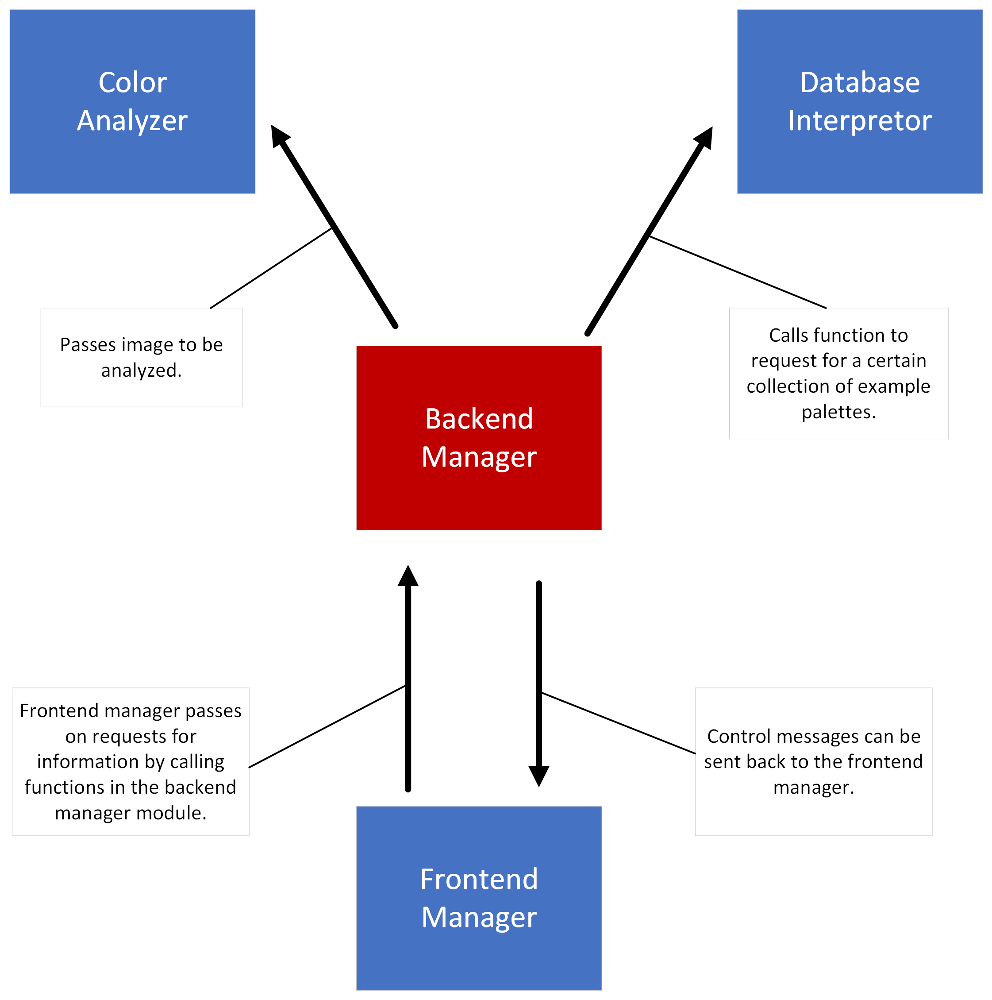

   Backend Manager Dynamic Model

.. raw:: latex

   \clearpage

This module was designed with ease of communication as the main goal. By establishing a central module where communication from the frontend to the backend passes, we are able to reduce the structural complexity of the system and do more with less function calls. Furthermore, by having the color analyzer and database interpretor return directly to the frontend, we avoided the need for extensive data processing and reformatting.

Color Analysis
-------------------

The primary function of this module is to the color analysis and generation that happens after a user has uploaded a photo. This module is made up of several sub-modules (divided by functionality) which are further divided into sub-sub modules. The static model below gives a visual picture of how the color analysis module is structured.

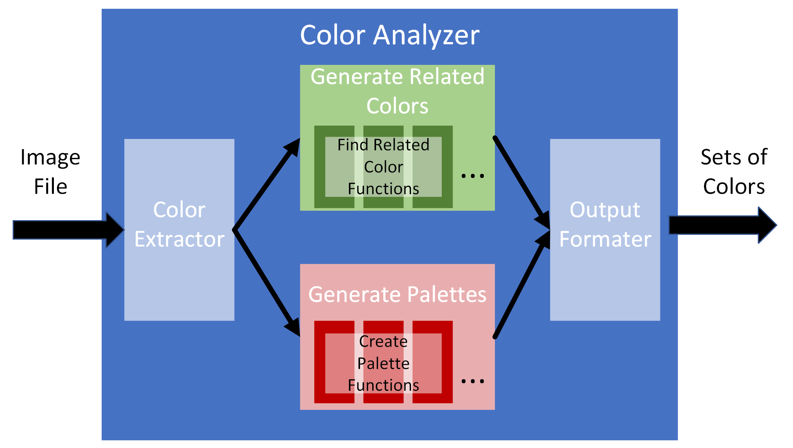

   Color Analysis Module Static Model

As the above model shows, essentially all of the work with color manipulation and analysis is done within the module. This makes for a high level of cohesion that allows for a weak coupling with other modules in the system. In fact, the color analysis module only has to interact with a single module which is the "Backend Manager." The backend manager passes an image in the form of a .png, .jpg, or .jpeg file and this module returns several sets of color codes as lists of hex code strings. The inter-module interactions of this part of the system are further specified in the dynamic model below.

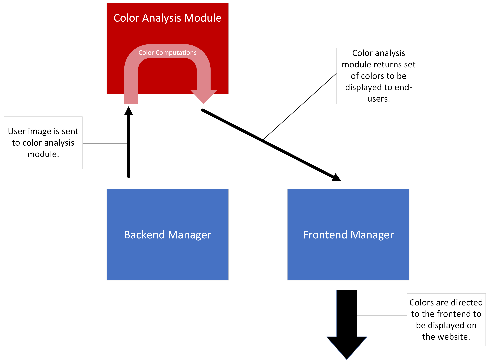

   Color Analysis Module Dynamic Model

.. raw:: latex

   \clearpage

This module was designed with a high degree modularity in mind. By separating the color analysis process into two parts, we are able to define two classes of sub-functions that share common features: palette generator functions and related color finder functions. This allows for code re-use and also source code that is easier to read and interpret. We also designed this module to have simple data types as both inputs and outputs. This allows easier integration with the rest of the system and fits well into our chosen framework (Flask).

Palette Database
------------------

The purpose of the Palette Database module will be to store popular palettes that many visitors to Gbiv have looked at. This will allow users to view a range of different color combinations and get inspiration for their design projects. Because there is only one collection of elements in the database for this project, the design of the database itself is somewhat straightforward. The static model below shows the layout visually:

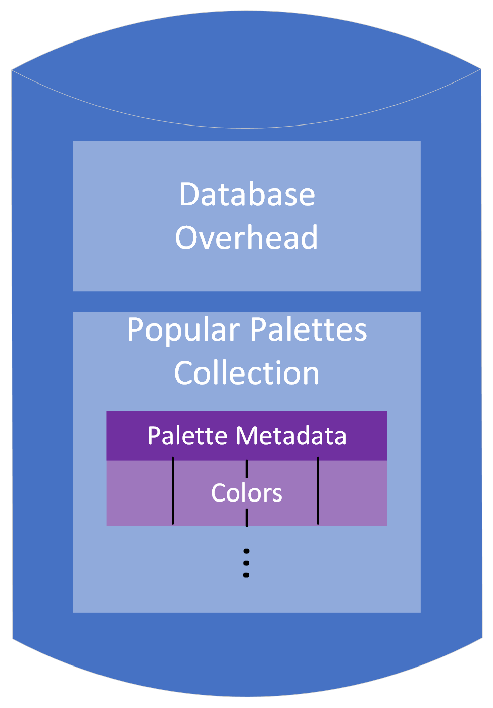

   Palette Database Static Model

The technology we will be using to implement our database (MongoDB) comes with a library that allows for efficient interfacing through python. Because of this built in advantage, we have designed the system so that the database has one module with which it communicates, the "Database Interpretor." This interface consists of a single type of input and a single type of output. When a user visits the "Popular Palettes" page, the frontend will query that backend which will reach the palette DB as a request to view the collection of palettes. When this query happens, the database will pass the collection on to the database interpretor module in a format that allows for easy movement to the end-users. Below we have included a dynamic model to demonstrate this interface.

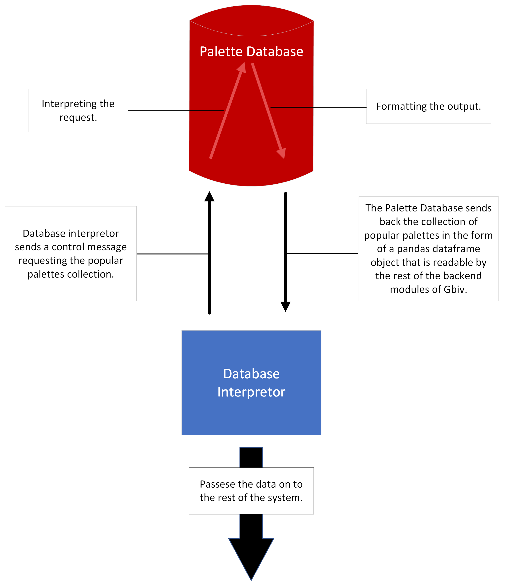

   Palette Database Dynamic Model

.. raw:: latex

   \clearpage

The design choices for the palette database module were made with the goal of simplicity. By keeping the number of collections to a minimum and formatting all data entries identically, the organization and movement of Gbiv's data can be straightforward and efficient. This prevents database accessing from being a bottleneck for performance, as well as reduces the need for more modules for data formatting.

Database Interpretor
----------------------

The database interpretor module exists so that the palette database can interface with the rest of the system. MonogDB was used to implement the database and it can be controlled by a python script using provided libraries. The rest of the system has also been implemented in python (with Flask as a framework), so it is very important that the Mongo database communications are translated into a python context. The database interpretor fills this need. To get a better idea of the structure of the interpretor, we can visualize it with the static model below:

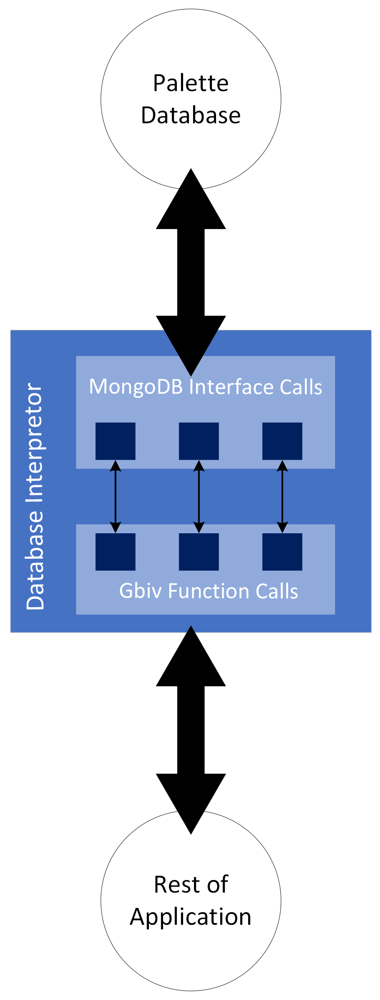

   Database Interpretor Static Model

.. raw:: latex

   \clearpage

Because of the nature of the this module, its interface with the rest of the system is defined by the needs of the palette database. Specifically, the database interpretor receives inputs from the backend manager which ask to query the DB for a certain collection of palettes--the interpretor translates these queries into a format compatible with MongoDB and sends them to the palette database. The database then returns collections of palettes to the interpretor, which again reformats the input and sends it as an output to the frontend manager. These interactions are more clear when shown visually as in the dynamic model below:

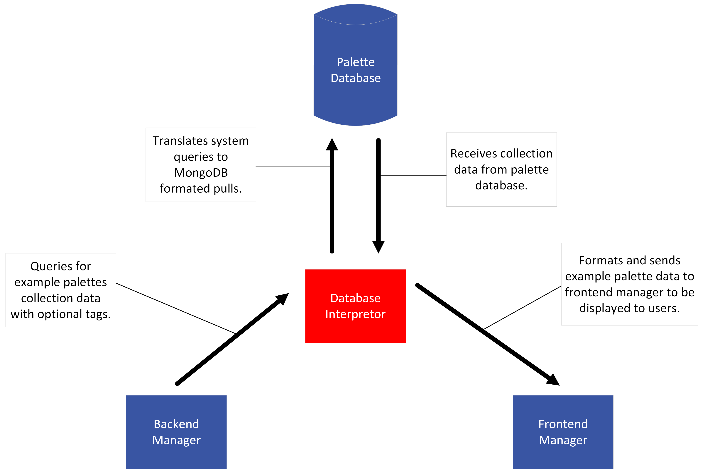

   Database Interpretor Dynamic Model

.. raw:: latex

   \clearpage

The idea behind having a module devoted entirely to interfacing with the database is that the technologies behind data storage and the rest of the system are very different. By using an interpretor, we can more smoothly integrate the example palettes into the end-user experience and have a more cohesive system overall. From an implementation point of view, this lets us code in python as much as possible which helps to reduce bugs and maintain consistent style/organization.

